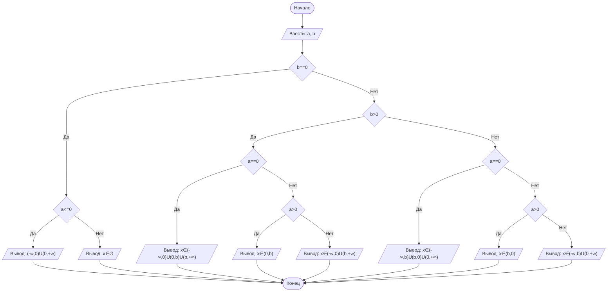

## Отчет по лабораторной работе № 1

#### № группы: `ПМ-2401`

#### Выполнил: `Иванов Михаил Алексеевич`

#### Вариант: `14`

### Cодержание:

- [Постановка задачи](#1-постановка-задачи)
- [Входные и выходные данные](#2-входные-и-выходные-данные)
- [Выбор структуры данных](#3-выбор-структуры-данных)
- [Алгоритм](#4-алгоритм)
- [Программа](#5-программа)
- [Анализ правильности решения](#6-анализ-правильности-решения)

### 1. Постановка задачи

> Программа получает на вход 2 числа a и b. Нужно решить неравенство A/(x*(B-x))>=0.

Данную задачу можно разделить на 3 подзадачи: определение отношений B и A к нулю и нахождение удовлетворяющих условию x.

- Для 1 подзадачи нужно рассмотреть 3 случая:
    1. `b == 0`
    2. `b > 0`
    3. `b < 0`
- Для 2 подзадачи нужно также рассмотреть 3 случая:
    1. `a == 0`
    2. `a > 0`
    3. `a < 0`

Всего надо рассмотреть `3 * 3 = 9` случаев.

### 2. Входные и выходные данные

#### Данные на вход

На вход программа должна получать 2 числа, при этом в условии не сказано, к какому множеству
принадлежать получаемые числа, поэтому будем считать их вещественными.

|             | Тип                |
|-------------|--------------------|
| A (Число 1) | Вещественное число |
| B (Число 2) | Вещественное число |

#### Данные на выход

Т.к. программа должна вывести значения x, удовлетворяющие условию задачи, то на вывод мы получим 
строку, содержащую некое неравенство или сстему неравенств.

|         | Тип    | Значение               |
|---------|--------|------------------------|
| Число 1 | Строка | в зависимости от A и B |

### 3. Выбор структуры данных

Программа получает 2 вещественных числа. Поэтому для их хранения
можно выделить 2 переменных (`a` и `b`) типа `double`.

|             | название переменной | Тип (в Java) | 
|-------------|---------------------|--------------|
| A (Число 1) | `a`                 | `double`     |
| B (Число 2) | `b`                 | `double`     | 

Для вывода результата необязательно его хранить в отдельной переменной.

### 4. Алгоритм

#### Алгоритм выполнения программы:

1. **Ввод данных:**  
   Программа считывает два вещественных числа, обозначенные как `a` и `b`.

2. **Сравнение чисел относительно нуля:**  
   Программа сравнивает значения `a` и `b` с нулем. 

3. **Для полученых результатов применяются математически выведенные формулы и утверждения:**
    - Если `a` = 0 и `b` > 0, то x∈(-∞,0)U(0,`b`)U(`b`,+∞)
    - Если `a` = 0 и `b` < 0, то x∈(-∞,`b`)U(`b`,0)U(0,+∞)
    - Если `a` > 0 и `b` > 0, то x∈(0,`b`)
    - Если `a` > 0 и `b` < 0, то x∈(`b`,0)
    - Если `a` < 0 и `b` > 0, то x∈(-∞,0)U(`b`,+∞)
    - Если `a` < 0 и `b` < 0, то x∈(-∞,`b`)U(0,+∞)
    - Если `a` <= 0 и `b` = 0, то x∈(-∞,0)U(0,+∞) *//неравенство "<=" рассматривает сразу 2 случая*
    - Если `a` > 0 и `b` = 0, то x∈∅

4. **Вывод результата:**  
   На экран выводится заранее заготовленные промежутки возможных x.

#### Блок-схема



### 5. Программа

```java
import java.io.PrintStream;
import java.util.Scanner;
public class Main {
   // Объявляем объект класса Scanner для ввода данных
   public static Scanner in = new Scanner(System.in);
   // Объявляем объект класса PrintStream для вывода данных
   public static PrintStream out = System.out;

   public static void main(String[] args) {
      // Считывание двух вещественных чисел a и b из консоли
      double a = in.nextDouble(), b = in.nextDouble();

      // Определение отношения b к 0
      if (b==0) {
         // Определение отношения a к 0, при b = 0
         // При a = 0 и a < 0 x имет одинаковую область допустимых значений (-∞,0)U(0,+∞)
         // При a > 0 x принадлежит пустому множеству
         if (a<=0) out.print("(-∞,0)U(0,+∞)");
         else out.print("x∈∅");
      } else if (b>0) {
         // Определение отношения a к 0, при b > 0
         // При a = 0 x принадлежит промежутку x∈(-∞,0)U(0,b)U(b,+∞)
         // При a > 0 x принадлежит промежутку x∈(0,b)
         // При a < 0 x принадлежит промежутку x∈(-∞,0)U(b,+∞)
         if (a==0) {
            out.print("x∈(-∞,0)U(0,"+b+")U("+b+",+∞)");
         } else if (a>0) {
            out.print("x∈(0,"+b+")");
         } else out.print("x∈(-∞,0)U("+b+",+∞)");
      } else {
         // Определение отношения a к 0, при b < 0
         // При a = 0 x принадлежит промежутку x∈(-∞,b)U(b,0)U(0,+∞)
         // При a > 0 x принадлежит промежутку x∈(b,0)
         // При a < 0 x принадлежит промежутку x∈(-∞,b)U(0,+∞)
         if (a==0) {
            out.print("x∈(-∞,"+b+")U("+b+",0)U(0,+∞)");
         } else if (a>0) {
            out.print("x∈("+b+",0)");
         } else out.print("x∈(-∞,"+b+")U(0,+∞)");
      }
   }
}
```

### 6. Анализ правильности решения

Программа работает корректно при всех возможных комбинациях знаков у A и B.

1. Тест на `A = 0` `B = 0`:

    - **Input**:
        ```
        0 0
        ```

    - **Output**:
        ```
        (-∞,0)U(0,+∞)
        ```

2. Тест на `A < 0` `B = 0`:

    - **Input**:
        ```
        -2 0
        ```

    - **Output**:
        ```
        (-∞,0)U(0,+∞)
        ```

3. Тест на `A > 0` `B = 0`:

    - **Input**:
        ```
        2 0
        ```

    - **Output**:
        ```
        x∈∅
        ```

4. Тест на `A = 0` или `B > 0`:

    - **Input**:
        ```
        0 3
        ```

    - **Output**:
        ```
        x∈(-∞,0)U(0,3.0)U(3.0,+∞)
        ```

5. Тест на `A < 0` или `B > 0`:

   - **Input**:
       ```
       -2 3
       ```

   - **Output**:
       ```
       x∈(-∞,0)U(3.0,+∞)
       ```

6. Тест на `A > 0` или `B > 0`:

   - **Input**:
       ```
       2 3
       ```

   - **Output**:
       ```
       x∈(0,3.0)
       ```

7. Тест на `A = 0` или `B < 0`:

   - **Input**:
       ```
       0 -3
       ```

   - **Output**:
       ```
       x∈(-∞,-3.0)U(-3.0,0)U(0,+∞)
       ```

8. Тест на `A < 0` или `B < 0`:

   - **Input**:
       ```
       -2 -3
       ```

   - **Output**:
       ```
       x∈(-∞,-3.0)U(0,+∞)
       ```

9. Тест на `A > 0` или `B < 0`:

   - **Input**:
       ```
       2 -3
       ```

   - **Output**:
       ```
       x∈(-3.0,0)
       ```
